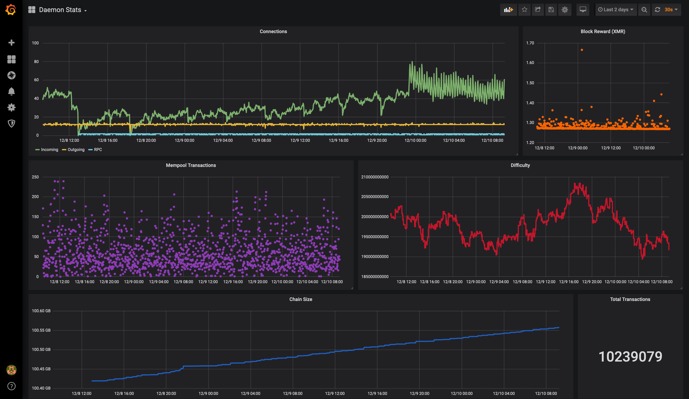

# docker-monero-node

Simple way to run a Monero node with some basic monitoring tools packaged in.

Leverages Prometheus, Grafana, and [ExcitableAardvark/monerod_exporter](https://github.com/ExcitableAardvark/monerod_exporter.git) on top of `monerod`.

## Setup

The only requirements are [Docker](https://docs.docker.com/get-docker/) and [Docker Compose](https://docs.docker.com/compose/install/). Ensure those are installed on your system. There's an optional `Makefile` provided if you'd like to use that, just ensure `make` is installed.

```
# Clone and enter the repository
git clone https://github.com/lalanza808/docker-monero-node
cd docker-monero-node

# OPTIONAL: Setup Grafana password and blockchain storage location
cp env-example .env
vim .env

# Build containers
docker-compose build  # make build
```

## Usage

It's fairly simple, use `docker-compose` to bring the containers up and down and look at logs.

```
# Run containers
docker-compose up -d  # make up

# Check all logs
docker-compose logs -f  # make logs

# Check monerod logs
docker-compose logs -f monerod
```

Navigate to http://localhost:3000 and log into Grafana. Find the `Daemon Stats` dashboard to get those sweet, sweet graphs.

If you've installed this on another system you will want to use [SSH tunnels](https://www.ssh.com/ssh/tunneling/example) (local forwarding) to reach Grafana:

```
ssh <VPS OR SERVER IP> -L 3000:localhost:3000
```

Then navigate to http://localhost:3000. Here is what the graph looks like:


