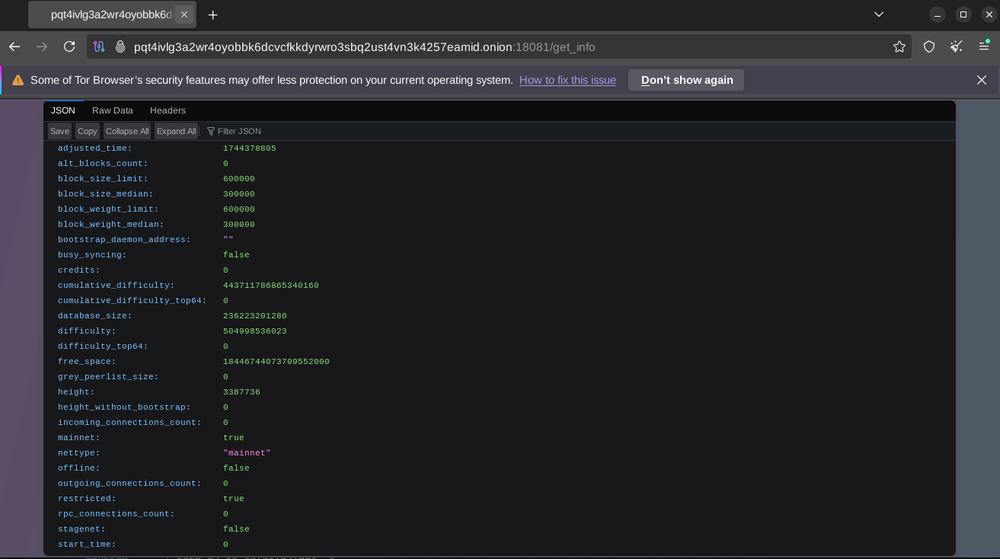

# docker-monero-node

Simple way to run a Monero node with some monitoring and anonymity tools packaged in:

* [monero-exporter](https://github.com/cirocosta/monero-exporter) - exposes metrics of the daemon
* [nodemapper](./dockerfiles/nodemapper.py) - gathers GeoIP data for peers
* [Prometheus](https://prometheus.io/docs/introduction/overview/) - monitors the exporter
* [Grafana](https://grafana.com/) - shows visualizations and dashboards
* [tor](https://www.torproject.org/) - provides tx relays over tor proxy and hidden service
* [i2pd](https://i2pd.website/) - provides tx relays over i2p proxy
* [explorer](https://github.com/lalanza808/moneroexplorer) - block explorer


## Setup

The only requirements are [Docker](https://docs.docker.com/get-docker/) and [Docker Compose](https://docs.docker.com/compose/install/). Ensure those are installed on your system. There's an optional `Makefile` provided if you'd like to use that, just ensure `make` is installed.

```
# Clone and enter the repository
git clone https://github.com/lalanza808/docker-monero-node
cd docker-monero-node

# OPTIONAL: Setup Grafana password, blockchain storage location, or port and container image tag overrides
cp env-example .env
vim .env
```

There are 2 routes depending on your preference.

### If you want to just pull the images (easier, faster)

This is the default behavior intended for ease of use, gets things running faster. Upstream images are on dockerhub:

* lalanza808/exporter:1.0.0
* lalanza808/nodemapper:1.0.4
* lalanza808/tor:1.0.2
* lalanza808/i2p:1.0.0
* lalanza808/monero:v0.18.4.4

```bash
docker compose up -d
```

### If you want to build the images yourself

Some people prefer to build things locally rather than assume the upstream is correct / not compromised (though you still assume base images are not compromised). You can review the Dockerfiles in [dockerfiles](./dockerfiles)

```bash
docker compose build
docker compose up -d
```

### Port Configurations

The following ports will be bound for `monerod` by default, but you can override in `.env`:
- 18080   # p2p
- 18081   # restricted rpc
- 18082   # zmq
- 18083   # unrestricted rpc
- 18084   # tor anonymous-inbound

The following ports are commented out but can be enabled to test things locally:
- 9090  # prometheus web ui
- 3000  # grafana web ui
- 9000  # exporter web api (/metrics)
- 5000  # nodemapper web api (/metrics)
- 9050  # tor proxy
- 4444  # i2p http proxy
- 4447  # i2p socks proxy

There are two hard-coded IP addresses for the tor and i2p proxies (monerod requires an IP address for setting the `--tx-proxy` flag.) You will need to modify your compose file if you need to adjust them.

You will want to open/allow ports 18080 and 18081 in your firewall for usage as a remote/public node (or whichever p2p and restricted ports you picked).

Also, you may want to setup a reverse proxy to Grafana if you would like to expose the visualizations for the world to see. Be sure to lock down the administrative settings or leave login disabled! You can see sample images below.

### Onion Address

Your `tor` container will be proxying outbound traffic (hiding transactions) and also allowing incoming connections to the Tor network (hidden service). A random onion address will be generated automatically. To view the address, either check the `monerod` container logs (it will be the first few lines), or read the file like so:

```bash
docker compose exec -ti tor cat /var/lib/tor/monerod/hostname
```

Load the URL in your Tor browser at port 18081 to confirm it's availability or for personal usage. http://<onion_address>:18081/get_info



It may take a few minutes for it to be reachable. Check the tor container logs to monitor bootstrap progress.

### Block Explorer

There is a built-in block explorer by default running on port 8000 (http://localhost:8000). Check [env-example](./env-example) to override these values.

## Usage

It's fairly simple, use `docker compose` to bring the containers up and down and look at logs.

```
# Run containers
docker compose up -d            # make up

# Check all logs
docker compose logs -f

# Check monerod logs
docker compose logs -f monerod  # make logs
```

### Running Locally

Navigate to http://localhost:3000 and find the `Node Stats` dashboard to get those sweet, sweet graphs.

### Running on VPS

If you've installed this on another system you will want to use [SSH tunnels](https://www.ssh.com/ssh/tunneling/example) (local forwarding) to reach Grafana if not running a reverse proxy:

```
ssh <VPS OR SERVER IP> -L 3000:localhost:3000
```

Then navigate to http://localhost:3000. Here is what the dashboard looks like:


